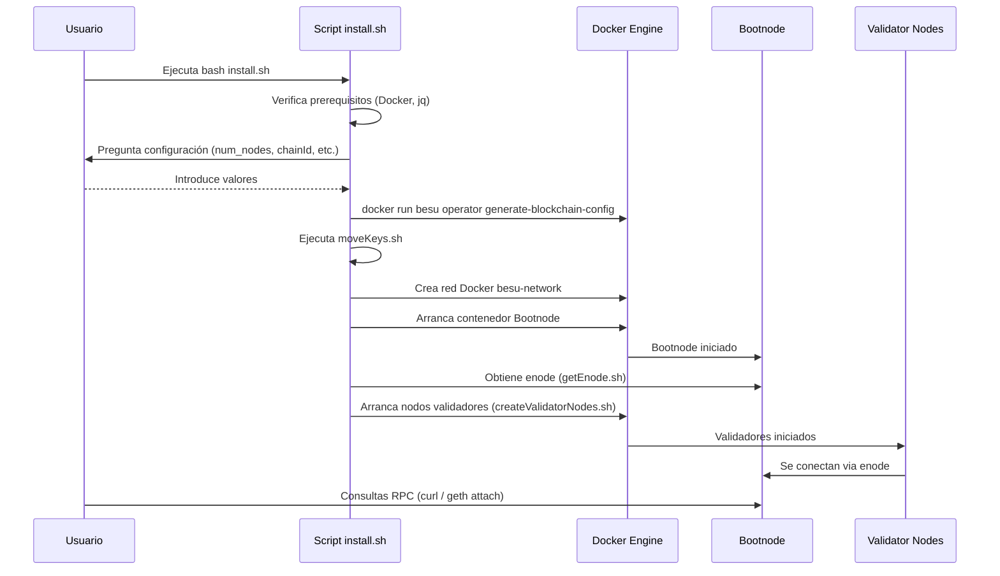
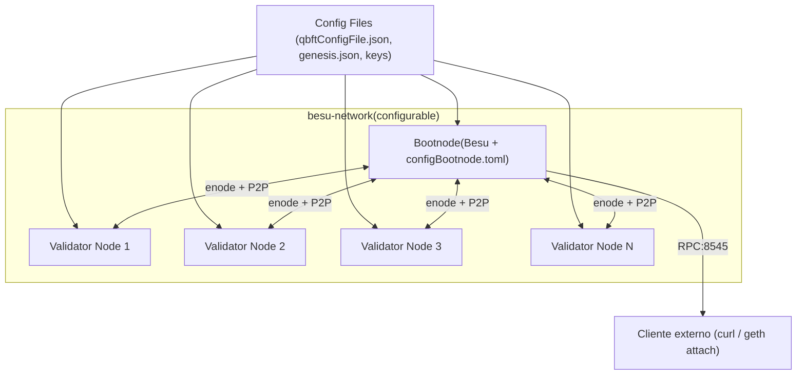

# ISBE-ART-02060 — Automatized Besu Docker Deployer

## **1. Identificación del Artefacto**

| Campo| Valor        |
| --------------------------- | ----------------------------------------------------------------------------------------------------------------------------------------------------------------------------------------------------- |
| **Nombre del artefacto**| ISBE-ART-02060 — Automatized Besu Docker Deployer|
| **Origen**| Conjunto de scripts (`install.sh`, auxiliares) y configuraciones (`config/qbftConfigFile.json`) para generar y desplegar automáticamente una red Hyperledger Besu QBFT en contenedores Docker.|
| **Estado**| Validado |
| **Versión del documento**   | 1.0.0|
| **Fecha** | 2025-11-20   |
| **Repositorio** | *https://github.com/alastria/isbe-besu-local-deployer*  |
| **Commit**| *5f80c00b5cdc88ee6c346d6552ec915fd2a42912*   |

---

## **2. Propósito del Artefacto**

* **Objetivo funcional:**
  Proveer una solución automatizada, portable y reproducible para generar y arrancar una red privada de Hyperledger Besu (consenso QBFT) mediante contenedores Docker, evitando la instalación directa de Besu en la máquina anfitriona. El artefacto genera la configuración de blockchain (genesis, claves de validadores), crea la red Docker personalizada, y arranca los contenedores correspondientes (bootnode y nodos validadores).

* **Beneficio para ISBE:**

  * Reduce el tiempo y complejidad para levantar entornos de prueba y demostración de blockchain (QA, Dev envs, staging, PoC, etc).
  * Estándar reproducible para equipos que necesiten validar integraciones o realizar pruebas funcionales/operacionales sin instalar dependencias nativas de Besu.
  * Facilita parametrización (número de nodos, chainId, periodos de bloque, curva elíptica, versión de Besu, rango IP) para distintos escenarios de despliegue. 

* **Stakeholders clave:**

  * Cualquier GT que necesite pruebas en local / GT Infraestructura (responsables del mantenimiento y evolución).
  * Squads de Desarrollo que necesitan una red privada para integración y pruebas.
  * QA / Automatización (para pipelines que validen contratos o integraciones).
  * Operaciones / SRE (monitorización y gestión de contenedores).
  * Seguridad y Cumplimiento (revisión de configuración de red y credenciales).
  * Consumidores internos: desarrolladores de smart contracts y arquitectos de soluciones.

## **3. Alcance y Ciclo de Vida**

* **Fases cubiertas:**

  * ✅ **Definición:**
    Documento y scripts proporcionan la definición de alto nivel de la red: parámetros por defecto (4 validadores, Besu `25.9.0`, curva `secp256k1`, `chainId=2222`, `blockperiodseconds=2`, IP base `172.16.240.x`), y el esquema de carpetas (`QBFT-Network/Node-<n>/data`) que se crea al ejecutar el instalador. Estas definiciones se expresan y aplican mediante `install.sh` y el archivo de configuración `config/qbftConfigFile.json` que el script modifica (jq).
  * ✅ **Desarrollo:**
    Materialización de la red: generación de archivos de red (`operator generate-blockchain-config` ejecutado en contenedor Besu), copia de `genesis.json`, distribución de keys a carpetas de nodos, creación de red Docker `besu-network`, arranque del `bootnode` y lanzado de los validadores por scripts auxiliares. Todo esto está automatizado en `install.sh` y los scripts auxiliares referenciados.

* **Momento en que se inicia cada fase y a qué entregable o paquete pertenece:**

  * Definición: al preparar el paquete de scripts/configuración (entregable: paquete `.tar` o repositorio con `install.sh`, `config/`, `moveKeys.sh`, `getEnode.sh`, `createValidatorNodes.sh`, `clean.sh`, `Readme.md`).
  * Desarrollo (materialización): al ejecutar `bash install.sh`, que ejecuta los pasos de generación de configuración, copia de artefactos, creación de red Docker y arranque de contenedores (entregable runtime: red Besu corriendo en Docker y carpeta `QBFT-Network` con los datos generados).

* **Dependencias:**

  * Requisitos SW: Docker, docker-compose, `jq`. (Readme indica explícitamente Docker y jq).
  * Scripts auxiliares no entregados en el ZIP (pero referenciados): `moveKeys.sh`, `getEnode.sh`, `createValidatorNodes.sh`, `clean.sh`. Estos deben existir en el mismo árbol de trabajo para que `install.sh` funcione correctamente; son dependencias lógicas del instalador.
    * Imagen Docker `hyperledger/besu:<version>` (ej. `25.9.0` por defecto) disponible en el registro de contenedores.

* **Mantenimiento:**

  * Actualizar versiones soportadas de Besu (p. ej. si se requiere probar contra nuevas versiones, modificar el valor por defecto y validar compatibilidad).
  * Mantener scripts auxiliares sincronizados con los cambios de `qbfConfigFile.json` y opciones de `operator generate-blockchain-config`.
  * Revisar y actualizar la documentación (README) cada vez que cambie el flujo de generación o los requisitos (Docker, jq, geth para consola).
  * Rotación y almacenamiento seguro de claves privadas generadas: definir política para no versionarlas en repositorios y proporcionar mecanismo seguro de backup.
  * Monitoreo de vulnerabilidades en imágenes Docker usadas y aplicar upgrades.

## **4. Definición del Artefacto**

* **4.1. Artefacto de arquitectura de referencia:**

  El artefacto sigue una arquitectura simple basada en contenedores con:

  * Red Docker `besu-network` (subnet configurable).
  * Contenedor `bootnode` (ejecuta Besu con `configBootnode.toml`).
  * N contenedores validadores (Node-1..Node-N) cada uno montando su folder `/opt/besu/data` con las keys generadas.
  * Volúmenes locales: `config/` (contiene `qbftConfigFile.json`, `configBootnode.toml`, `genesis.json`), `QBFT-Network/Node-X/data`.
  * Herramienta de generación ejecutada en contenedor `hyperledger/besu:<vers>` para producir `networkFiles` (operator generate-blockchain-config).

* **4.2. Trazabilidad:**

  * Mapeo entre requisitos funcionales y artefactos:

    * Requisito: despliegue reproducible sin instalar Besu en host → Implementación: `install.sh` ejecuta `docker run hyperledger/besu` para generar configuración y arranca contenedores Docker.
    * Requisito: parametrización de red y consenso → Implementación: parámetros editables en `install.sh` (`chainId`, `blockperiodseconds`, `num_nodes`, `besuVersion`, `ellipticCurve`, `ip`) y escritura con `jq` sobre `config/qbftConfigFile.json`.

* **4.3. Descripción funcional detallada:**

* Diagramas visuales:

  * Flujo principal (alto nivel):

    1. Comprobación de prerrequisitos: Docker presente y corriendo. (exit si no).
    2. Interacción usuario: pregunta si desea cambiar configuración por defecto; si se acepta, solicita número de nodos, versión de Besu, chainId, block period y (opcional) configuración avanzada (elliptic curve e IP base). Validaciones en bash para formatos y rangos. Podemos ver un ejemplo de como podemos ir avanzando en la configuración a medida que vamos eligiendo configuraciones custom:

            sh install.sh 
            Docker is installed and running.
            Cleaning up previous setup folders...
            Do you want to -- CHANGE THE DEFAULT CONFIGURATION ? --  (4 validators nodes, Besu version 25.9.0, Eliptic Curve secp256k1, chainId 2222, 2 sec between blocks, IP 172.16.240.0) Please enter 'y' or 'n': y
            Enter the number of nodes (including the bootnode, minimum 4): 5
            Enter the version of Besu (format: 25.9.0): 21.12.1
            Enter the chain ID (e.g. 1234): 3333
            Enter the block period in seconds (between 2 - 30): 3
            Do you want to -- CHANGE THE ADVANCE CONFIGURATION -- ?  (Elliptic Curve, IP Address) Please enter 'y' or 'n': y
            Enter the elliptic curve (secp256k1 or secp256r1): secp256r1
            Enter the IP address mask (first 3 numbers, e.g. 172.16.240): 172.16.241

    3. Modificación del fichero `config/qbftConfigFile.json` mediante `jq` para aplicar `chainId`, `blockperiodseconds`, `ecCurve` y `blockchain.nodes.count`.
    4. Creación de estructura de carpetas `QBFT-Network/Node-<i>/data`.
    5. Invocar contenedor `hyperledger/besu` con `operator generate-blockchain-config` para producir `networkFiles` (genesis, keys, etc). Copiar `genesis.json` a `config/`.
    6. Ejecutar `moveKeys.sh` para distribuir claves a carpetas de nodos. (script auxiliar esperado).
    7. Crear network Docker `besu-network` con subnet `${ip}.0/24` si no existe.
    8. Arrancar `bootnode` (docker run) exponiendo puertos 30303/8545/9545 y con IP fija `${ip}.30`.
    9. Ejecutar `getEnode.sh ${ip}.30` para recuperar `enode` del bootnode e insertarlo en configuraciones de validator (script auxiliar).
    10. Ejecutar `createValidatorNodes.sh $besuVersion $num_nodes $ip` para levantar el resto de validadores.

  * Casos de uso cubiertos:

    * Levantar una red QBFT local reproducible para pruebas.
    * Personalizar parámetros de red (nodos, chainId, curva, block time, versión).
    * Limpiar y reiniciar la red (`clean.sh` mencionado en README).

* **4.4. Modelos o diagramas específicos:**

  * Componentes: `bootnode`, `Validator Node 1..N`, `Docker network (besu-network)`, `config` volume.
  * Secuencia de arranque: `install.sh` → `generate-blockchain-config` → `moveKeys.sh` → crear network → arrancar bootnode → getEnode → crear validadores → nodos se sincronizan → comienzo de produción de Bloques. 

* **4.5. Reglas de negocio asociadas:**

  * Número mínimo de nodos: 4 (incluye bootnode). El script valida y exige `num_nodes >= 4 && <= 100`.
  * Formato de versión de Besu exigido: regex `^[0-9]{2}\.[0-9]{2}\.[0-9]+$` (ej. `25.9.0`) en la entrada avanzada.
  * Rango válido de `blockperiodseconds`: entre 2 y 30 segundos.
  * Validación de IP base: debe pertenecer a rango privado (10.x.x, 172.16-31.x, 192.168.x).

* **4.6. Interfaces y puntos de integración:**

  * El bootnode expone por defecto la interfaz RPC HTTP en el puerto 8545 (mapeado al host), además de otros puertos configurables. Esta interfaz permite realizar consultas JSON-RPC mediante herramientas como curl o conectarse a la consola interactiva con geth attach. En el README se incluyen ejemplos prácticos de uso (eth_getBalance, eth.chainId(), etc.), que demuestran cómo interactuar con la red desplegada a través de esta interfaz.

  * Endpoints: puerto HTTP (8545), P2P (30303), otros puertos auxiliares (9545). Configurable en los contenedores del bootnode y validadores.

  * Estructura de datos: en este caso el `genesis.json` define los parámetros de la red. Este archivo incluye, entre otros, el algoritmo de consenso utilizado (QBFT en este caso), cuentras pre fondeadas en el "alloc" y la curva elíptica seleccionada para las claves. Ejemplo (fragmento del genesis.json):

        {
          "config": {
            "chainId": 2222,
            "ecCurve": "secp256k1",
            "qbft": {
              "blockperiodseconds": 2,
              "epochlength": 1000,
              "requesttimeoutseconds": 2
            },
          },
          "alloc": {
            "0x1234567890abcdef1234567890abcdef12345678": {
            "balance": "0xad78ebc5ac6200000"
          }
        }
    Este fichero es la fuente de verdad de la red y puede revisarse para confirmar el algoritmo de consenso y la configuración de seguridad aplicada.

* **4.7. Normativas y requisitos regulatorios:**

  * No hay tratamiento automático de datos personales en el scope del despliegue; sin embargo, se generan pares clave privada/pública (que son sensibles). Recomendaciones: no versionar claves en control de código, cifrar backups y almacenar en vaults seguros conforme a políticas internas.
  * Si el uso de la red o logs incluye datos personales reales, aplicar RGPD: minimización de datos, conservación limitada y medidas técnicas de protección. (El artefacto en sí facilita entornos de prueba — evitar usar datos reales en pruebas).

* **4.8. Criterios de calidad específicos:**

  * Tiempo de respuesta esperado en entorno local: no más de unos segundos en la puesta en marcha (dependiente de descarga de imágenes y generación), y bloques según `blockperiodseconds`.
  * Seguridad: asegurar permisos de ficheros (keys), no exponer puertos a redes no controladas, y emplear imágenes oficiales y actualizadas.
  * Usabilidad: interacción por consola con validaciones y mensajes de estado; documentación básica en `Readme.md` para instalación y troubleshooting.

## **5. Desarrollo del Artefacto**

* **5.1. Componentes del artefacto:**

  * `install.sh` — script principal de instalación y arranque (verifica Docker, modifica config/qbftConfigFile.json con `jq`, genera red, arranca bootnode y lanza validadores).
  * `Readme.md` — documentación de uso, prerequisitos, deploy, comandos útiles (geth attach, curl) y troubleshooting.
  * `config/qbftConfigFile.json` — plantilla de configuración para `operator generate-blockchain-config` (modificada por `install.sh` con jq). (Incluida en paquete).
  * `config/configBootnode.toml` — (referenciado) configuración para el bootnode.
  * `moveKeys.sh`, `getEnode.sh`, `createValidatorNodes.sh`, `clean.sh` — scripts auxiliares que deben estar disponibles y ejecutables en el mismo directorio.

* **5.2. Lista de elementos clave producidos: código, scripts, configuraciones, manuales:**

  | Nombre| Descripción    | Enlace / Ruta   |
  | ----------------------------------------------------------- | -------------------------------------------------------------------------------------------------------------------------------------------------------------------------------- | -------------------------------------------------------- |
  | install.sh    | Script principal que automatiza la generación de configuración, creación de carpetas y arranque de bootnode y validadores. | `./install.sh`. |
  | Readme.md     | Documentación de uso, prerequisitos y troubleshooting con comandos ejemplo.  | `./Readme.md`.  |
  | qbftConfigFile.json| Fichero de configuración base para `operator generate-blockchain-config` (modificado por `install.sh` con jq).             | `./config/qbftConfigFile.json`.   |
  | networkFiles (salida)                | Archivos generados por Besu: `genesis.json`, claves de validadores, etc.     | `./QBFT-Network/networkFiles/` (generado en ejecución).  |
  | moveKeys.sh, getEnode.sh, createValidatorNodes.sh, clean.sh | Scripts auxiliares para distribuir claves, recuperar enode, crear nodos y limpiar la red.           | `./moveKeys.sh` etc. (deben existir en el paquete).      |
  | Última versión liberada              | Versionado de artefacto: versionado no incluido en los scripts. Recomendación: etiquetar releases en repo (ej. `v1.0.0`) y registrar la `besuVersion` usada en notas de release. | -  |

* **5.3. Frameworks, librerías o tecnologías acordadas:**

  * Docker & docker-compose (contenedorización).
  * Hyperledger Besu (imagen Docker `hyperledger/besu:<version>`).
  * jq (para manipulación JSON en bash).
  * Bash scripting y utilidades UNIX básicas (`cp`, `mkdir`, `sleep`, `docker` CLI).

* **5.4. Buenas prácticas aplicables:**

  * No almacenar claves privadas ni `networkFiles` generadas en repositorios públicos. Mantener en artefactos seguros o vaults.
  * Versionar los scripts y mantener changelog en el repo. Registrar la versión de Besu utilizada en cada release.
  * Ejecutar `dos2unix` en archivos si se usan entornos WSL/Windows, como indica el README.
  * Revisar y actualizar imágenes base con regularidad por motivos de seguridad.
  * Añadir checksums o firmas de los artefactos clave si se van a distribuir fuera de la organización.

* **5.5. Criterios de validación del desarrollo:**

  * Pruebas unitarias: No aplica directamente (scripts bash); se recomienda añadir pruebas de integración que validen: creación de carpetas, generación de `genesis.json`, arranque del bootnode y validadores, respuesta a RPC básico (`eth_chainId`, `eth_blockNumber`).
  * Auditorías: Validar que las claves generadas no se han subido a VCS (Version Control System), revisar permisos de ficheros.
  * Evidencias: logs de ejecución de `install.sh`, salida de `docker ps` mostrando contenedores con etiquetas `project=besu`, y ejemplos de llamadas RPC (`curl` o `geth attach`) tal como describe `Readme.md`.

* **5.6. Alineación con requisitos legales (GDPR, NIS2, etc.)**

  * El artefacto puede generar datos que, si se usan con información real, podrían ser considerados datos personales. Recomendación: evitar datos reales en entornos de test y aplicar controles de acceso a los volúmenes con keys. Documentar y auditar el uso de entornos que puedan contener datos personales.
  * Para entornos de producción, coordinar con el área legal y de seguridad para cumplir NIS2 / regulaciones específicas de infraestructura crítica si procede.
  * La elección de curva elíptica es configurable (secp256k1 o secp256r1). El caso de k1 garantiza compatibilidad con el ecosistema Ethereum, mientras que r1 responde a normativas de seguridad (ej. FIPS/NIST), permitiendo adaptarse a entornos con mayores exigencias regulatorias.

* **5.7. Dependencias técnicas o de infraestructura:**

  * Host con Docker y recursos suficientes (CPU, RAM, espacio en disco para imágenes y datos de nodos).
  * Acceso al registro Docker para descargar `hyperledger/besu:<version>`.
  * Permisos para crear redes Docker y puertos en host (exposición de 30303/8545/9545, etc.).

* **5.8. Limitaciones temporales:**

  * El artefacto está pensado como entorno de desarrollo / pruebas (MVP); no implementa hardening ni orquestación para producción (no incorpora HA (High Availability) fuera de la configuración QBFT ni gestión de certificados, backups automáticos o integración con secret managers).
  * El tiempo total de despliegue depende de la descarga de imágenes y generación de claves; por tanto no es determinístico en entornos con conexión lenta.

* **5.9. Limitaciones por versiones, licencias o configuraciones.**

  * Dependencia de la versión de Besu: ciertos flags o comportamiento del comando `operator generate-blockchain-config` pueden cambiar entre versiones; el script solicita y valida el formato de versión, pero no garantiza compatibilidad hacia atrás/adelante más allá de la verificación de formato.
  * Licencias: usar las imágenes oficiales `hyperledger/besu` conforme a sus licencias. Ver política interna sobre uso de imágenes públicas.

## **6. Reglas de Control y Actualización**

* **Política de gestión de versiones para la fase de definición y desarrollo:**

  * Versionado semántico sugerido para el artefacto (`vMAJOR.MINOR.PATCH`) en el repositorio git. Registrar en cada release: `besuVersion` por defecto usado, fecha y cambios en scripts auxiliares.
  * Taggear releases con un changelog y notas de compatibilidad.

* **Indicar si es actualizable tras la entrega, por quién y bajo qué condiciones:**

  * Sí, es actualizable por el equipo de Infra o GT Cliente (propietario del artefacto). Las actualizaciones deben pasar por revisión de Pull Request, pruebas de integración y un despliegue de verificación en un entorno de staging. Cambios en parámetros por defecto (ej. `besuVersion`) deben aparecer en el changelog.

* **Frecuencia de revisión o actualizaciones planificadas:**

  * Revisión trimestral mínima o al salir una versión mayor de Besu que afecte al flujo. Revisión inmediata ante vulnerabilidades críticas en imágenes Docker.

* **Herramienta de control de cambios:**

  * Repositorio GitHub para versionado del artefacto, control de Pull Requests, CI y publicación de releases. Documentación en la wiki técnica del proyecto.
  * Para artefactos binarios o generados (networkFiles), usar almacenamiento controlado (artifactory, S3 privado) y no subir claves privadas a VCS.

| Tipo de cambio  | Versionado | Flujo de aprobación    | Documentación requerida    |
| --------------- | ---------- | ---------------------------------------------------------------------------- | ------------------------------------------------------------------------ |
| Evolutivo menor | X.Y+0.1    | Pull Request + revisión del equipo Infra/Cliente   | Release notes detalladas con pasos de verificación y cambios en defaults |
| Evolutivo mayor | X+1.0      | Pull Request + aprobación del Comité de Arquitectura / Infra (o equivalente) | Impact analysis, plan de migración, pruebas de compatibilidad            |

---

## Anexos

### Anexo 1 – Notas finales operativas y de uso

* Ejecutar `bash install.sh` para iniciar el despliegue; el script realizará comprobaciones y pedirá confirmaciones/valores al usuario si se cambia la configuración por defecto.
* Para limpiar/ detener la red, ejecutar `bash clean.sh` tal como indica la documentación.
* Si se ejecuta en WSL/Windows: usar `dos2unix * config/*` para corregir finales de línea antes de ejecutar los scripts.
* Comprobar que `jq` está instalado para permitir las modificaciones JSON que realiza el script.

